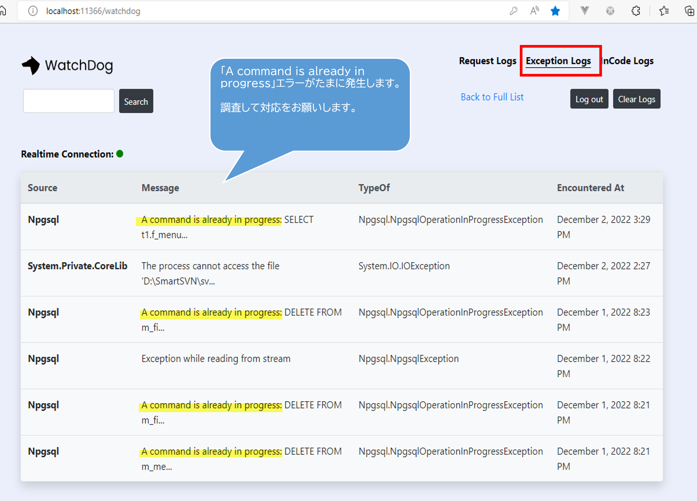

事情是这样的，上一周（2023年1月2日-6日）要我调查一个BUG。
BUG的表现是PG数据库执行SQL语句时，不定时抛出异常。

## 异常信息
异常信息：「A command is already in progress」「指令已经在执行」
错误类型：「Npgsql.NpgsqlOperationInProgressException」

## 异常定位
这个项目是一个使用ASP.NET Core框架的WEB API项目。

出现问题的借口位置位于一个异步API的逻辑处理中。

查看LOG，发现LOG中同时还有数据库连接多次重复开启的LOG记录。

在查看Log后，我第一反应是代码执行造成的多个线程抢占一个对象，在当前数据库连接还未执行完上一条指令时，便又被执行其他的指令了。

然而，随着我的排查的深入，看代码逻辑发现，我在方向上是错误的，这个问题并不是异步或者多线程造成的，而是由于编码人员在编写的时候将数据库连接相关操作类写成了单例模式。

## 异常解决
虽然问题表象来看应该是多线程的问题，但实际上应该是使用单例模式的问题，既然已经定位实际问题所在，那么解决方案就十分简单了。
抛弃掉单例模式，转而使用数据库连接池，或者每次处理新建一个数据库连接即可。
